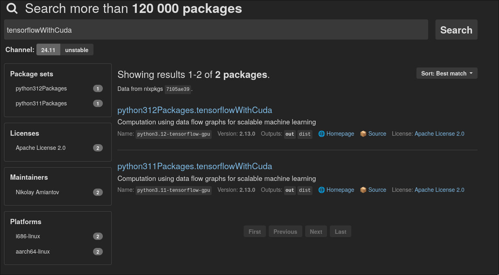
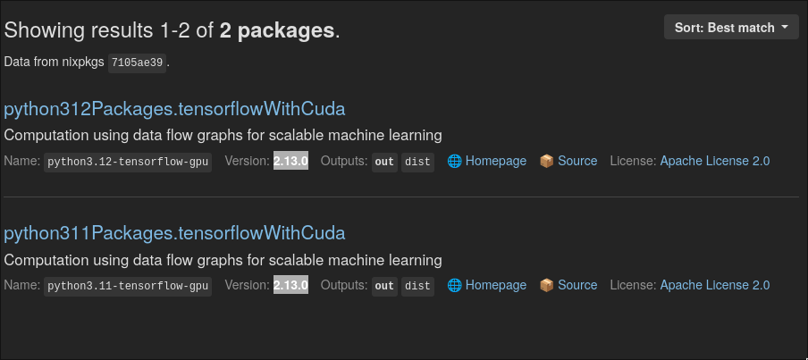
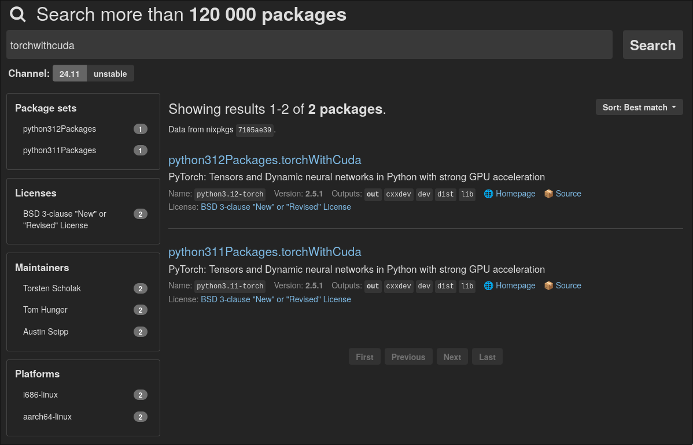
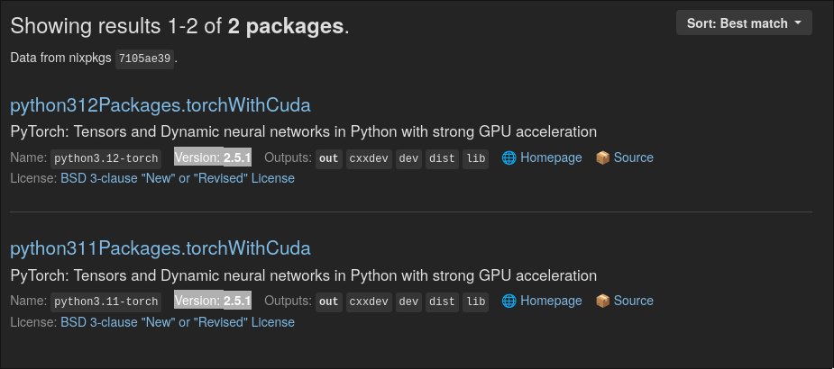
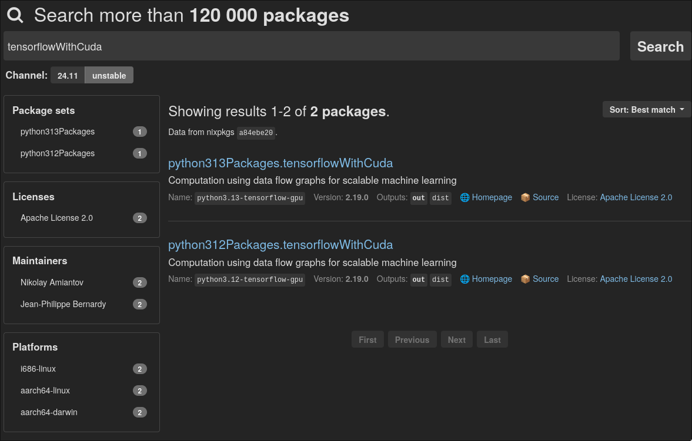
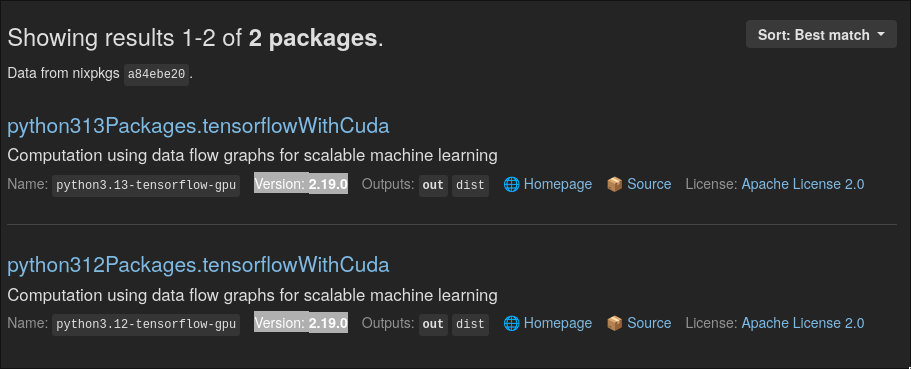
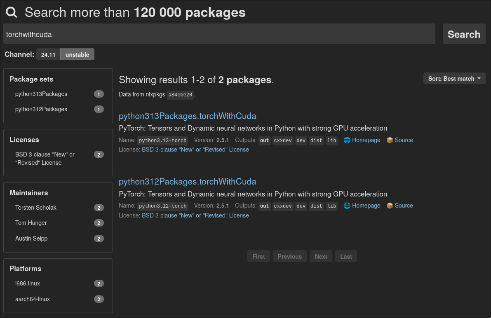
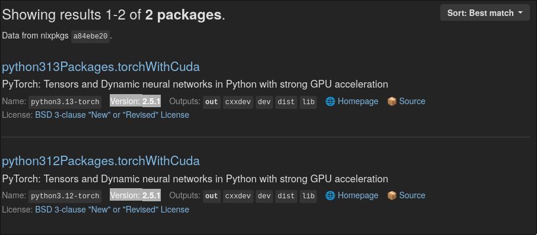

# CUDA en NixOS

Nvidia tiene la mala fama de hacerle la vida imposible a usuarios de Linux producto de la naturaleza propietaria de sus códigos. Sin embargo, herramientas como CUDA son utilizadas por muchos para acelerar cálculos computacionales a través de GPU. Configurar y utilizar las capacidad de las tarjetas gráficas de Nvidia puede ser un tremendo dolor de cabeza para quienes trabajan con Linux, pero sobretodo, con una distribuición tan epecial como lo es NixOS, por lo que he decidido documentar y explicar a través de este repo el proceso para poder utilizar dichas herramientas en un contexto de programación de Python con Tensorflow y/o Torch.


## Configuración del sistema.

Primero que nada, es necesario configurar el sistema en general, obteniendo los drivers necesarios de Nvidia. Esta información se encuentra en la página de [Nvidia de la Wiki de NixOS](https://nixos.wiki/wiki/Nvidia). 

Para este caso, las configuraciones utilizadas se encuentran en [nvidia.nix](nvidia.nix). Normlamente se pueden copiar directamente, con la excepción de `prime`, que sólo aplica a sistemas con GPUs híbridas, como es el caso de la mayoría de las laptops con GPU integrada + GPU dedicada. Lo anterior también está explicado en la página de [Nvidia de la Wiki de NixOS](https://nixos.wiki/wiki/Nvidia). 

```nix
hardware.graphics.enable = true;
services.xserver.videoDrivers = ["nvidia"];

hardware.nvidia = {
  modesetting.enable = true;
  powerManagement.enable = false;
  powerManagement.finegrained = false;
  open = false;
  nvidiaSettings = true;
  package = config.boot.kernelPackages.nvidiaPackages.latest;
  nvidiaPersistenced = true;


  # Sólo para GPUs híbridas
  # Tarjeta gráfica integrada + dedicada
  # Este es el caso de la mayoría de las laptops
  prime = {
      intelBusId = "PCI:0:2:0";
      nvidiaBusId = "PCI:1:0:0";
      offload = {
        enable = true;
        enableOffloadCmd = true;
      };
  };
};
```

## Agregar los Caches de la Nix Community Cachix.

Si uno intenta instalar CUDA directamente con nixpkgs como:
```nix
  environment.systemPackages = [
    pkgs.cudaPackages.cudatoolkit
  ];
```
Por lo general CUDA se compilará localmente del sistema, lo cual puede tardar varias horas. Para evitar esto, se utilizan los Caches de la [Nix Community](https://app.cachix.org/cache/nix-community) y los [Cuda Maintainers de Cachix](https://app.cachix.org/cache/cuda-maintainers) , los cuales proveen con binarios listos para utilizar. 

Para utilizar Cachix, se deben agregar las siguientes líneas a nuestro `configuration.nix`:

```nix
nix.settings = {
  substituters = [
    "https://nix-community.cachix.org"
	  "https://cuda-maintainers.cachix.org"
  ];
  trusted-public-keys = [
    "nix-community.cachix.org-1:mB9FSh9qf2dCimDSUo8Zy7bkq5CX+/rkCWyvRCYg3Fs="
    "cuda-maintainers.cachix.org-1:0dq3bujKpuEPMCX6U4WylrUDZ9JyUG0VpVZa7CNfq5E="
  ];
};
```

Para que funcione, se debe reconstruir el sistema con `sudo nixos-rebuild switch`, y con esto deberíamos poder descargar directamente los binarios desde el cache de la Nix Community.

Si por alguna razón se llegasen a cambiar las Public Keys, se pueden obtener desde los siguientes links:
https://app.cachix.org/cache/nix-community
https://app.cachix.org/cache/cuda-maintainers

## Verificar que versiones de Python y paquetes tienen binarios disponibles.

Si bien ahora se poseen los Caches de Cachix, no todas las versiones de Python y sus paquetes tienen binarios disponibles. Para verificar cuales si, debemos utilizar los siguientes comandos:


```
nix search nixpkgs tensorflowWithCuda
nix search nixpkgs torchWithCuda
```

Es MUY IMPORTANTE utilizar las versiones `WithCuda` de los paquetes a instalar, puesto las versiones normales, `tensorflow` y `torch` para este caso, no tienen la capacidad de aceleración por GPU, incluso si se instala `cudatoolkit` por separado.

Al utilizar los comandos mencionados anteriormente, se deberían obtener resultados como los mostrados a continuación:

```
$ nix search nixpkgs tensorflowWithCuda

* legacyPackages.x86_64-linux.python312Packages.tensorflowWithCuda (2.19.0)
  Computation using data flow graphs for scalable machine learning

* legacyPackages.x86_64-linux.python313Packages.tensorflowWithCuda (2.19.0)
  Computation using data flow graphs for scalable machine learning
``` 

```
$ nix search nixpkgs torchWithCuda
* legacyPackages.x86_64-linux.python312Packages.pytorchWithCuda (2.5.1)
  PyTorch: Tensors and Dynamic neural networks in Python with strong GPU acceleration

* legacyPackages.x86_64-linux.python312Packages.torchWithCuda (2.5.1)
  PyTorch: Tensors and Dynamic neural networks in Python with strong GPU acceleration

* legacyPackages.x86_64-linux.python313Packages.pytorchWithCuda (2.5.1)
  PyTorch: Tensors and Dynamic neural networks in Python with strong GPU acceleration

* legacyPackages.x86_64-linux.python313Packages.torchWithCuda (2.5.1)
  PyTorch: Tensors and Dynamic neural networks in Python with strong GPU acceleration
```

Las dos cosas que hay que prestar atención son:
1. La versión de Python
2. La versión del paquete de Python

Para conocer el primer punto, se debe observar la sección que dice `...python312Packages...` y `...python313Packages...`. Esto nos indica que existen binarios SÓLO para Python versiones 3.12 y 3.13, por lo que si se necesita otra versión de Python se deberá compilar localmente CUDA, o utilizar otras herramientas como `conda`.

En el segundo punto, la información relevante se encuentra entre () al final del nombre del paquete. `(2.19.0)` y `(2.5.1)` para `tensorflow` y `torch` respectivamente. Estos números corresponden a la versión de los paquetes y es importante verificar en que canal de Nix Packages están disponibles. Por ejemplo, si buscamos [tensoflowWithCuda en el canal estable](https://search.nixos.org/packages?channel=24.11&from=0&size=50&sort=relevance&type=packages&query=tensorflowWithCuda) (canal estable es 24.11 al momento de escribir esto), nos encontramos con que está la versión 2.13.0 para Python 3.11 y 3.12. Si bien Python no es un problema, porque se puede utlizar 3.12, la versión del `tensorflow` mismo es 2.13.0, lo que significa que no existen los binarios en Cachix, así que no nos sirve.


### Verificación canal estable 24.11


Figura 1: Resultados de búsqueda de `tensorflowWithCuda` en el [canal estable 24.11 de Nix Packages](https://search.nixos.org/packages?channel=24.11)



Figura 2: Versión de `tensorflowWithCuda` resaltado.


Con lo anterior, podemos concluir que NO podemos utilizar el canal estable, al menos para el caso de `tensorflow`, ya que si se replica el mismo proceso anterior para `torch`, este SÍ tiene binarios en el [canal estable 24.11 de Nix Packages](https://search.nixos.org/packages?channel=24.11), puesto que la versión del paquete es 2.5.1 por lo que si sólo se necesitara `Torch`, podríamos utilizarlos sin cambiar el canal.


Figura 3: Resultados de búsqueda de `torchWithCuda` en el [canal estable 24.11 de Nix Packages](https://search.nixos.org/packages?channel=24.11)



Figura 4: Versión de `torchWithCuda` resaltado.


### Verificación canal inestable

Como `tensorflow` no tiene binarios en el canal estable 24.11, buscamos los mismos paquetes, pero en el [canal unstable de Nix Packages](https://search.nixos.org/packages?channel=unstable), en donde sí tenemos la versión 2.19.0 de `tensorflow`, y Python 3.12 y 3.13, con lo cual no deberíamos tener ningún problema.



Figura 5: Resultados de búsqueda de `tensorflowWithCuda` en el [canal unstable de Nix Packages](https://search.nixos.org/packages?channel=unstable)



Figura 6: Versión de `tensorflowWithCuda` resaltado.


El caso de `torch` es similar, se tiene Python 3.12 y 3.13, pero la versión del paquete se mantiene en 2.5.1, lo cual nos permite utilizar tanto el canal estable como el unstable.



Figura 7: Resultados de búsqueda de `torchWithCuda` en el [canal unstable de Nix Packages](https://search.nixos.org/packages?channel=unstable)



Figura 8: Versión de `torchWithCuda` resaltado.

### Versiones a utilizar.

Con los resultados anteriores, si queremos tener aceleración por GPU con CUDA para `tensorflow` y `torch`, debemos utilizar las versiones 2.19.0 y 2.5.1 respectivamente, además de Python 3.12 o 3.13. Esto utilizando el [canal unstable de Nix Packages](https://search.nixos.org/packages?channel=unstable).


## Crear un flake o un shell.nix para nuestro proyecto.


Una de las grandes ventajas de Nix y NixOS frente a otras distros, es la posibilidad de crear shells aislados de forma nativa, es decir no necesitamos depender de `venv` o ambientes de conda para trabajar con Phython. Lo mismo aplica para otros lenguajes de programación. Con estas mismas herramientas, también podemos definir exactamente las versiones de los paquetes que necesitamos.

Como en el la sección anterior determinamos que necesitamos las versiones 2.19.0 y 2.5.1 para `tensorflow` y `torch` respectivamente, además de Python versiones 3.12 o 3.13, podemos crear un `shell` o `flake` para crear un ambiente aislado que cumpla con estos requerimientos.

A continuación se muestran dos ejemplos de un `shell` y `flake` para crear nuestro ambiente con Python 3.12.

- Nix Shell
```nix
{ pkgs ? import (fetchTarball "https://nixos.org/channels/nixpkgs-unstable/nixexprs.tar.xz") {} }:

pkgs.mkShell {
  buildInputs = with pkgs; [

    # Instala python 3.12
    python312
    (python312.withPackages (ps: with ps; [
      # Paquetes normales de Python.
      pandas numpy matplotlib seaborn scikit-learn openpyxl
      xlrd jupyterlab yfinance pytz
      
      # Paquetes con aceleración por GPU con CUDA
      tensorflowWithCuda 
      torchWithCuda #torchvision-bin torchaudio-bin # Usar torchvision y torchaudio genera conflictos con dependencias
    ]))
  ];

  shellHook = ''
    echo "Entorno de Python activado."
  '';
}
```

- Flake
```nix
{
  description = "Entorno de desarrollo modelo predicción IPSA";

  inputs = {
    nixpkgs.url = "github:NixOS/nixpkgs/nixos-unstable";
    flake-utils.url = "github:numtide/flake-utils";
  };


  outputs = { self, nixpkgs, flake-utils }:
    flake-utils.lib.eachDefaultSystem (system:
      let
        pkgs = import nixpkgs { inherit system;
                                config.allowUnfree = true;
                              };
      in {
        devShells.default = pkgs.mkShell {
          buildInputs = with pkgs; [

            # Instala python 3.12
            python312
            (python312.withPackages (ps: with ps; [
              # Paquetes normales de Python
              pandas numpy matplotlib seaborn scikit-learn openpyxl
              xlrd jupyterlab yfinance pytz

              # Paquetes con aceleración por GPU con CUDA
              tensorflowWithCuda 
              torchWithCuda #torchvision-bin torchaudio-bin # Usar torchvision y torchaudio genera conflictos con dependencias
            ]))
          ];
        shellHook = ''
          echo "Entorno de Python activado."
        '';

        
        };
      });

}
```

De las configuraciones anteriores, lo más importante es definir dentro del `buildInputs` la versión de Python, en este caso `python312`, y utilizar el canal unstable con `{ pkgs ? import (fetchTarball "https://nixos.org/channels/nixpkgs-unstable/nixexprs.tar.xz") {} }:` para el `shell`, o `nixpkgs.url = "github:NixOS/nixpkgs/nixos-unstable";` para el `flake`.


## Verificar CUDA

Una vez configurado el `shell` o el `flake`, entramos al ambiente con `nix-shell` o `nix develop` respectivamente. Esperamos que se descargue todo y luego entramos a python y verificamos los siguientes comandos:


```python
import torch
import tensorflow as tf

torch.cuda.is_available()
print(tf.config.list_physical_devices('GPU'))
```

Si todo está bien, deberíamos tener un resultado como:

```python
>>> torch.cuda.is_available()
True

>>> print(tf.config.list_physical_devices('GPU'))
[PhysicalDevice(name='/physical_device:GPU:0', device_type='GPU')]
```

Con lo anterior nos aseguramos de que CUDA está funcionando en NixOS.